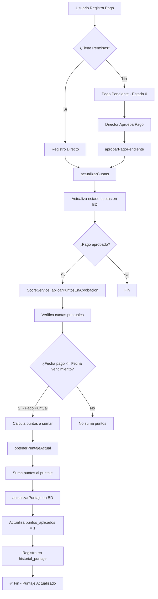

# 📊 FLUJO COMPLETO DEL SISTEMA DE PUNTOS - AREQUIPAGO

## 🎯 Resumen Ejecutivo

**ArequiPago** cuenta con un **sistema de puntaje crediticio** que permite evaluar el comportamiento de pago de conductores y clientes. Los puntos se actualizan automáticamente cuando se registra el pago de cuotas de financiamiento.

---

## 📁 Archivos Principales Involucrados

| Archivo                                                                                                                         | Descripción                  | Rol en el Sistema                 |
| ------------------------------------------------------------------------------------------------------------------------------- | ---------------------------- | --------------------------------- |
| [`pagos-financiamiento.php`](file:///c:/laragon/www/arequipago/resources/views/fragment-views/cliente/pagos-financiamiento.php) | Vista de registro de pagos   | Frontend donde se registran pagos |
| [`PagosController.php`](file:///c:/laragon/www/arequipago/app/http/controllers/PagosController.php)                             | Controlador de pagos         | Gestiona aprobación de pagos      |
| [`ScoreService.php`](file:///c:/laragon/www/arequipago/app/models/ScoreService.php)                                             | Servicio de score crediticio | **Aplica puntos al pagar cuotas** |
| [`PuntajeCrediticioController.php`](file:///c:/laragon/www/arequipago/app/http/controllers/PuntajeCrediticioController.php)     | Controlador de puntaje       | Obtiene estadísticas y historial  |
| [`credit-score.php`](file:///c:/laragon/www/arequipago/resources/views/fragment-views/cliente/credit-score.php)                 | Vista de score crediticio    | Visualización de puntajes         |
| [`web.php`](file:///c:/laragon/www/arequipago/routes/web.php)                                                                   | Rutas principales            | Define endpoints                  |
| [`ajax2.php`](file:///c:/laragon/www/arequipago/routes/ajax2.php)                                                               | Rutas AJAX                   | Define endpoint de aprobación     |

---

## 🔄 Flujo Completo: ¿Cómo se Actualizan los Puntos?



---

## 📋 Proceso Detallado Paso a Paso

### **1️⃣ Registro del Pago**

**Vista**: `pagos-financiamiento.php`

El usuario (asesor/conductor) ingresa al módulo de pagos y realiza el registro de pago de una o varias cuotas.

**Flujo de datos**:

- Se busca al conductor/cliente por DNI
- Se seleccionan las cuotas a pagar
- Se elige el método de pago
- Se presiona "Registrar Pago"

---

### **2️⃣ Validación de Permisos**

El sistema verifica si el usuario tiene permisos para aprobar pagos directamente:

**Dos caminos posibles**:

#### **A) Usuario CON permisos (Director/Administrador)**

- El pago se registra directamente con **estado = 1 (Aprobado)**
- Se llama a `ScoreService::aplicarPuntosEnRegistroDirecto()`

#### **B) Usuario SIN permisos (Asesor)**

- El pago se registra con **estado = 0 (Pendiente)**
- Queda en espera de aprobación del director

---

### **3️⃣ Aprobación de Pago Pendiente**

**Controlador**: [`PagosController.php`](file:///c:/laragon/www/arequipago/app/http/controllers/PagosController.php#L468-L636)

**Ruta**: `POST /ajs/aprobarPagoPendiente` (definida en [`ajax2.php:97`](file:///c:/laragon/www/arequipago/routes/ajax2.php))

**Método**: `aprobarPagoPendiente()`

**Proceso**:

1. Inicia transacción de base de datos
2. Actualiza el estado del pago a **1 (Aprobado)**
3. Obtiene las cuotas del JSON almacenado en `pagos_pendientes_financiamientos`
4. Actualiza las cuotas en la tabla `cuotas_financiamiento`
5. Hace commit de la transacción
6. **PUNTO CRÍTICO**: Llama a `ScoreService::aplicarPuntosEnAprobacion($idPago)`

```php
// Líneas 607-616 de PagosController.php
try {
    require_once 'app/models/ScoreService.php';
    $scoreService = new ScoreService();
    $scoreService->aplicarPuntosEnAprobacion($idPago);
} catch (Exception $e) {
    error_log("Error al aplicar puntos: " . $e->getMessage());
}
```

> 🔥 **Importante**: La aplicación de puntos ocurre FUERA de la transacción principal para evitar bloqueos (deadlocks).

---

### **4️⃣ Aplicación de Puntos** ⭐ **NÚCLEO DEL SISTEMA**

**Servicio**: [`ScoreService.php`](file:///c:/laragon/www/arequipago/app/models/ScoreService.php#L149-L269)

**Método**: `aplicarPuntosEnAprobacion($idPago)`

#### **Paso 4.1: Obtener cuotas puntuales**

El sistema consulta las cuotas que cumplen con las condiciones:

- `fecha_pago <= fecha_vencimiento` (Pago puntual)
- `puntos_aplicados = 0` (No se han aplicado puntos aún)

```sql
SELECT dp.id_cuota, cf.fecha_pago, cf.fecha_vencimiento, cf.puntos_aplicados,
       f.id_conductor, f.id_cliente
FROM detalle_pago_financiamiento dp
INNER JOIN cuotas_financiamiento cf ON dp.id_cuota = cf.idcuotas_financiamiento
INNER JOIN financiamiento f ON cf.id_financiamiento = f.idfinanciamiento
WHERE dp.idfinanciamiento = ?
AND cf.puntos_aplicados = 0
AND cf.fecha_pago <= cf.fecha_vencimiento
```

#### **Paso 4.2: Calcular puntos a sumar**

**Método**: `calcularPuntosPorPago($tipo, $idReferencia)`

**Lógica de cálculo** (líneas 322-346 de [`ScoreService.php`](file:///c:/laragon/www/arequipago/app/models/ScoreService.php#L322-L346)):

| Nº de Financiamientos Activos | Puntos por Cuota Puntual |
| ----------------------------- | ------------------------ |
| **1 financiamiento**          | **+5 puntos**            |
| **2 o más financiamientos**   | **+3 puntos**            |

```php
// Regla: 1 financiamiento = +5 puntos, más de 1 = +3 puntos
return ($totalFinanciamientos == 1) ? 5 : 3;
```

#### **Paso 4.3: Obtener puntaje actual**

**Método**: `obtenerPuntajeActual($tipo, $idReferencia)`

Busca el puntaje actual del conductor/cliente en la tabla `puntaje_crediticio`:

- Si existe, retorna `puntaje_actual`
- Si no existe, retorna **100** (puntaje inicial)

#### **Paso 4.4: Actualizar puntaje**

**Método**: `actualizarPuntaje($tipo, $idReferencia, $puntajeNuevo)`

Suma los puntos UNA SOLA VEZ para todas las cuotas:

```php
$puntosTotal = $puntosASumar * count($cuotasPuntuales);
$puntajeNuevo = min(100, $puntajeAnterior + $puntosTotal);
```

> 📊 **Límite**: El puntaje máximo es **100 puntos**.

Actualiza la tabla `puntaje_crediticio`:

```sql
UPDATE puntaje_crediticio
SET puntaje_actual = ?,
    total_financiamientos = ?,
    ultima_actualizacion = NOW()
WHERE tipo = ? AND id_referencia = ?
```

#### **Paso 4.5: Marcar cuotas como procesadas**

Para evitar duplicados, marca las cuotas como procesadas en BATCH:

```sql
UPDATE cuotas_financiamiento
SET puntos_aplicados = 1
WHERE idcuotas_financiamiento IN (?, ?, ...)
AND puntos_aplicados = 0
```

#### **Paso 4.6: Registrar historial**

Registra cada cambio en la tabla `historial_puntaje_crediticio`:

```php
$this->puntajeModel->registrarHistorialPuntajeBatch($historialRegistros);
```

**Datos registrados**:

- `id_puntaje_crediticio`
- `puntaje_anterior`
- `puntaje_nuevo`
- `puntos_perdidos` (0 para pagos puntuales)
- `motivo` (ej: "Pago puntual de cuota (+5 puntos)")
- `id_cuota`
- `fecha_cambio`

---

## 🗄️ Tablas de Base de Datos Involucradas

### **Tabla: `pagos_financiamiento`**

| Campo                    | Descripción                          |
| ------------------------ | ------------------------------------ |
| `idpagos_financiamiento` | ID del pago                          |
| `estado`                 | 0=Pendiente, 1=Aprobado, 2=Rechazado |
| `id_conductor`           | ID del conductor (si aplica)         |
| `id_cliente`             | ID del cliente (si aplica)           |
| `fecha_pago`             | Fecha en que se realizó el pago      |
| `monto_total`            | Monto total del pago                 |

### **Tabla: `cuotas_financiamiento`**

| Campo                     | Descripción                           |
| ------------------------- | ------------------------------------- |
| `idcuotas_financiamiento` | ID de la cuota                        |
| `id_financiamiento`       | ID del financiamiento                 |
| `numero_cuota`            | Número de la cuota                    |
| `monto_cuota`             | Monto de la cuota                     |
| `fecha_vencimiento`       | Fecha de vencimiento                  |
| `fecha_pago`              | Fecha en que se pagó                  |
| `estado`                  | Estado de la cuota                    |
| **`puntos_aplicados`**    | 0=No procesado, 1=Puntos ya aplicados |

### **Tabla: `puntaje_crediticio`**

| Campo                   | Descripción                      |
| ----------------------- | -------------------------------- |
| `idpuntaje_crediticio`  | ID del puntaje                   |
| `tipo`                  | 'conductor' o 'cliente'          |
| `id_referencia`         | ID del conductor/cliente         |
| **`puntaje_actual`**    | Puntaje actual (0-100)           |
| `total_financiamientos` | Total de financiamientos activos |
| `total_retrasos`        | Total de pagos con retraso       |
| `ultima_actualizacion`  | Última vez que se actualizó      |

### **Tabla: `historial_puntaje_crediticio`**

| Campo                   | Descripción                    |
| ----------------------- | ------------------------------ |
| `id_historial_puntaje`  | ID del historial               |
| `id_puntaje_crediticio` | Referencia al puntaje          |
| `puntaje_anterior`      | Puntaje antes del cambio       |
| `puntaje_nuevo`         | Puntaje después del cambio     |
| `puntos_perdidos`       | Puntos perdidos (si hubo mora) |
| `motivo`                | Descripción del cambio         |
| `id_cuota`              | ID de la cuota procesada       |
| `fecha_cambio`          | Fecha del cambio               |

---

## 📊 Visualización en el Sistema

### **Vista de Score Crediticio**

**Archivo**: [`credit-score.php`](file:///c:/laragon/www/arequipago/resources/views/fragment-views/cliente/credit-score.php)

**Funcionalidades**:

- ✅ **Tarjetas de estadísticas**: Total clientes, conductores, promedio, en riesgo
- 🔍 **Filtros**: Por tipo (cliente/conductor), rango de puntaje, fechas
- 📊 **Tarjetas individuales**: Muestra puntaje con velocímetro visual
- 📈 **Historial detallado**: Timeline de pagos con cambios de puntaje
- 🔄 **Actualización manual**: Botón para recalcular todos los puntajes

**Endpoints utilizados**:

- `GET /arequipago/obtenerEstadisticasPuntaje`
- `GET /arequipago/obtenerClientesPuntaje`
- `GET /arequipago/obtenerDetalleCliente`
- `GET /arequipago/obtenerHistorialPuntaje`
- `POST /arequipago/actualizarPuntajesCrediticios`

---

## 🎨 Niveles de Puntaje

| Rango  | Nivel         | Color       | Descripción         |
| ------ | ------------- | ----------- | ------------------- |
| 76-100 | **Excelente** | 🟢 Verde    | Cliente confiable   |
| 51-75  | **Bueno**     | 🟡 Amarillo | Buen comportamiento |
| 26-50  | **Regular**   | 🟠 Naranja  | Necesita mejorar    |
| 0-25   | **Malo**      | 🔴 Rojo     | Cliente en riesgo   |

---

## ⚙️ Optimizaciones Implementadas

### **1. Procesamiento en Batch**

En lugar de actualizar cuota por cuota, se procesan todas de una vez:

```php
// ❌ ANTES: Loop individual (lento)
foreach ($cuotas as $cuota) {
    actualizarCuota($cuota);
}

// ✅ AHORA: Batch update (rápido)
UPDATE cuotas_financiamiento
SET puntos_aplicados = 1
WHERE idcuotas_financiamiento IN (1, 2, 3, ...)
```

### **2. Sin Transacciones Anidadas**

La aplicación de puntos ocurre FUERA de la transacción principal para evitar deadlocks.

### **3. Cálculo Único de Puntos**

Se calcula UNA SOLA VEZ antes del loop, no en cada iteración.

### **4. Sin FOR UPDATE**

Se eliminaron los locks de fila (`FOR UPDATE`) que causaban bloqueos.

---

## 🔐 Validaciones y Seguridad

### **Prevención de Duplicados**

✅ Campo `puntos_aplicados` en la tabla `cuotas_financiamiento`
✅ Verificación antes de aplicar puntos
✅ Actualización en batch con condición `AND puntos_aplicados = 0`

### **Integridad de Datos**

✅ Uso de transacciones para pagos
✅ Manejo de excepciones robusto
✅ Logs de errores (`error_log()`)

### **Permisos**

✅ Validación de roles (directores pueden aprobar)
✅ Sesiones verificadas (`$_SESSION['usuario_id']`)

---

## 📝 Ejemplo Práctico

### **Escenario**:

Juan (conductor) tiene 1 financiamiento activo de un celular. Paga 3 cuotas de manera puntual.

### **Proceso**:

1. **Puntaje actual**: 85 puntos
2. **Pago registrado**: 3 cuotas puntuales
3. **Cálculo**:
   - Tiene 1 financiamiento → +5 puntos por cuota
   - 3 cuotas × 5 puntos = +15 puntos
4. **Nuevo puntaje**: 85 + 15 = **100 puntos** ✅
5. **Actualización**:
   - `puntaje_crediticio`: 100
   - `cuotas_financiamiento`: puntos_aplicados = 1
   - `historial_puntaje_crediticio`: 3 registros nuevos

### **Resultado**:

Juan ahora tiene **100 puntos** (Excelente) y puede solicitar nuevos financiamientos con mejores condiciones.

---

## 🚀 Siguientes Pasos Recomendados

### **Mejoras Potenciales**:

1. 📧 **Notificaciones**: Enviar email/SMS cuando el puntaje cambia
2. 🎁 **Recompensas**: Ofrecer descuentos a clientes con 100 puntos
3. 📊 **Reportes**: Dashboard con gráficos de tendencias
4. ⏰ **Tareas programadas**: Cron job para actualizar puntajes diarios
5. 🔔 **Alertas**: Notificar cuando un cliente cae por debajo de 50 puntos

---

## 🆘 Troubleshooting

### **Problema**: Los puntos no se aplican

**Solución**: Verificar:

- Estado del pago (debe ser 1 - Aprobado)
- Campo `puntos_aplicados` en cuotas (debe ser 0)
- Fecha de pago vs fecha de vencimiento

### **Problema**: Puntos duplicados

**Solución**:

- El campo `puntos_aplicados` previene esto
- Si ocurre, revisar logs y ejecutar script de limpieza

### **Problema**: Puntaje no se muestra en la vista

**Solución**:

- Verificar que existe registro en `puntaje_crediticio`
- Si no existe, ejecutar `actualizarPuntajesCrediticios()`

---

## 📚 Referencias Rápidas

### **Archivos Clave**

- Controlador de Pagos: [`PagosController.php:607-616`](file:///c:/laragon/www/arequipago/app/http/controllers/PagosController.php#L607-L616)
- Servicio de Score: [`ScoreService.php:149-269`](file:///c:/laragon/www/arequipago/app/models/ScoreService.php#L149-L269)
- Cálculo de puntos: [`ScoreService.php:322-346`](file:///c:/laragon/www/arequipago/app/models/ScoreService.php#L322-L346)

### **Rutas**

- Aprobar pago: `POST /ajs/aprobarPagoPendiente`
- Ver score: `GET /arequipago/obtenerClientesPuntaje`
- Historial: `GET /arequipago/obtenerHistorialPuntaje`

---

> **✨ Nota Final**: Este sistema fue optimizado para evitar bloqueos de base de datos y mejorar el rendimiento mediante procesamiento en batch y cálculos únicos.
